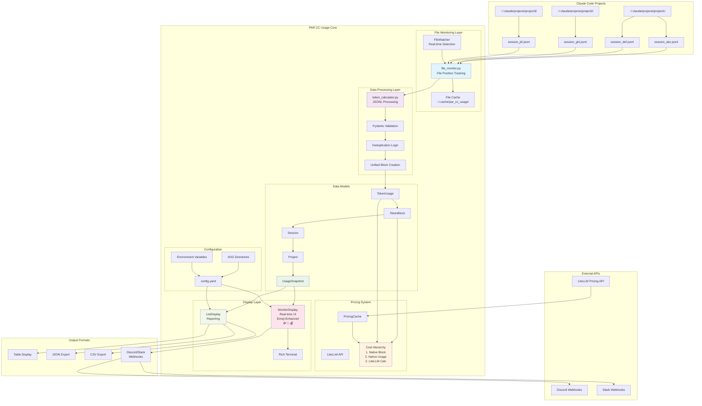

# CLAUDE.md

This file provides guidance to Claude Code (claude.ai/code) when working with code in this repository.

## Project Overview

PAR CC Usage is a Python-based CLI tool for tracking and analyzing Claude Code token usage across multiple projects. It monitors JSONL files in Claude's project directories, provides real-time usage statistics with tool usage tracking and pricing display enabled by default, and manages 5-hour billing blocks.

## Development Commands

### Installation and Setup
```bash
# Install dependencies with uv (required)
uv sync
```

### Running the Application
```bash
# Run in development mode with hot reload
make dev

# Run normally
make run
# or
uv run pccu monitor
```

### Tool Usage Display (Default Enabled)

PAR CC Usage now displays Claude Code tool usage by default, providing insights into which tools (Read, Edit, Bash, etc.) are being used most frequently.

**Display Format**: Tool names appear in orange color, with usage totals in cyan parentheses for easy visual distinction:
- Example: `Read, Edit, Bash (25)` - where "Read, Edit, Bash" is orange and "(25)" is cyan

```bash
# Default behavior - tool usage displayed automatically
uv run pccu monitor

# Disable tool usage display if desired
uv run pccu monitor --no-tools

# Explicitly enable tool usage (redundant with new defaults)
uv run pccu monitor --show-tools

# Tool usage in snapshot mode for quick debugging
uv run pccu monitor --snapshot     # Shows tools by default
uv run pccu monitor --no-tools --snapshot  # Hides tools

# Tool usage is always tracked in cache - instant toggle without rebuilds
# Switch between modes instantly:
uv run pccu monitor --show-tools --snapshot  # Instant display
uv run pccu monitor --no-tools --snapshot    # Instant hide
uv run pccu monitor --show-tools --snapshot  # Instant display again
```

**Key Benefits:**
- **Always Tracked**: Tool usage data is cached regardless of display settings
- **Zero Performance Impact**: Toggling display on/off processes only new messages
- **Instant Toggle**: Switch between `--show-tools`/`--no-tools` without cache rebuilds
- **Rich Information**: See which tools are used most frequently across projects and sessions

### Code Quality Commands
```bash
# Format, lint, and typecheck (run before commits)
make checkall

# Individual commands
make format      # Fix formatting with ruff
make lint        # Check linting with ruff  
make typecheck   # Type check with pyright
```

### Testing and Debugging

# Run tests
```bash
make test
```

```bash
# Debug unified block calculation
uv run pccu debug-unified

# Debug block information
uv run pccu debug-blocks --show-inactive

# Test webhooks (Discord/Slack)
uv run pccu test-webhook

# Take a single debug snapshot (monitor once and exit)
uv run pccu monitor --snapshot

# Enable debug output (debug messages are suppressed in monitor mode to maintain clean display)
uv run pccu monitor --debug

# Note: Debug output is automatically suppressed during continuous monitor mode
# to prevent console jumping and maintain a clean, stable display interface

# Tool usage display is enabled by default - disable with --no-tools
uv run pccu monitor --no-tools --snapshot

# Test pricing functionality including burn rate cost estimation
uv run pccu monitor --show-pricing --snapshot
uv run pccu list --show-pricing

# Test pricing with different output formats
uv run pccu list --show-pricing --format json
uv run pccu list --show-pricing --format csv --output usage_with_costs.csv

# Debug pricing fallbacks (using Python directly)
uv run python -c "
import asyncio
from src.par_cc_usage.pricing import debug_model_pricing, calculate_token_cost

async def test():
    # Test unknown model handling
    info = await debug_model_pricing('Unknown')
    cost = await calculate_token_cost('Unknown', 1000, 500)
    print(f'Unknown model: \${cost.total_cost}, info: {info}')

    # Test fallback pricing
    cost = await calculate_token_cost('claude-opus-custom', 1000, 500)
    print(f'Custom opus model cost: \${cost.total_cost}')

asyncio.run(test())
"

# Test burn rate cost estimation specifically
uv run pytest tests/test_display.py -k "test_calculate_burn_rate" -v
```

### Tool Usage Testing

Tool usage tracking is now always enabled in the cache with display enabled by default for immediate insights.

```bash
# Default behavior - tool usage displayed automatically (NEW DEFAULT)
uv run pccu monitor --snapshot

# Disable tool usage display when desired
uv run pccu monitor --no-tools --snapshot

# Explicitly enable (redundant with new defaults, but still supported)
uv run pccu monitor --show-tools --snapshot

# Performance testing - instant toggle without cache rebuilds
uv run pccu monitor --show-tools --snapshot  # ~0.3s (only new messages)
uv run pccu monitor --no-tools --snapshot    # ~0.3s (only new messages)
uv run pccu monitor --show-tools --snapshot  # ~0.3s (only new messages)

# Compare with old behavior (forcing full rebuild)
uv run pccu monitor --no-cache --snapshot    # ~3.9s (all 40,000+ messages)
```

**Performance Improvements:**
- **12x Faster Startup**: Tool display toggle processes 1-2 new messages vs 40,000+ previously
- **Always Ready**: Tool data cached regardless of display preference
- **Zero Rebuild Cost**: Cache metadata tracks tool usage state automatically

### Cost Analysis (Default Enabled)

PAR CC Usage displays comprehensive cost information by default, providing insights into Claude Code API spending and budget tracking.

**Display Features**: Real-time cost tracking with 💰 emoji indicators throughout the interface:
- Token usage costs in monitor display
- Burn rate cost estimation for 5-hour blocks
- Individual project/session cost breakdown
- Cost totals and maximums tracking

```bash
# Default behavior - pricing displayed automatically
uv run pccu monitor

# Disable pricing display if desired  
uv run pccu monitor --no-pricing

# Pricing in list mode for detailed cost analysis
uv run pccu list                # Shows costs by default
uv run pccu list --no-pricing   # Hides cost information

# Export cost data for analysis
uv run pccu list --format json --output costs.json
uv run pccu list --format csv --output costs.csv
```

## Troubleshooting

### Cache System Overview

PAR CC Usage uses a high-performance cache system to track file positions and avoid re-processing entire JSONL files. The cache provides dramatic performance improvements (0.3s vs 3.9s startup) and ensures data consistency.

**Key Cache Features:**
- **Single FileMonitor Instance**: The monitor uses one FileMonitor throughout the entire process to maintain cache consistency
- **Position Tracking**: Stores last read position for each JSONL file to process only new content
- **Smart Deduplication**: Prevents double-counting tokens when files are accessed multiple times
- **Automatic Updates**: Cache is updated in real-time as new data is processed

### Cache Performance

The cache system provides significant performance benefits:

```bash
# With cache enabled (default)
uv run pccu monitor --snapshot    # ~0.3s startup
uv run pccu monitor              # Fast real-time updates

# With cache disabled (for debugging)
uv run pccu monitor --no-cache --snapshot  # ~3.9s startup
```

### Data Inconsistencies

If counts, costs, or tool usage appear incorrect or inconsistent, the most common cause is cached data from a previous version or corrupted cache state.

```bash
# Clear all cached data and force complete re-processing
uv run pccu clear-cache

# Verify the issue is resolved
uv run pccu monitor --snapshot

# Alternative: disable cache for one-time verification
uv run pccu monitor --no-cache --snapshot
```

**When to clear cache:**
- Token counts don't match expected values
- Tool usage shows incorrect tools or counts
- Cost calculations seem wrong
- After upgrading PAR CC Usage versions
- When debugging data processing issues
- If display shows stale or missing information
- If monitor shows no data initially then wrong data after delays

**Note**: Cache clearing forces re-processing of all JSONL files, which may take 3-4 seconds for large datasets but ensures data accuracy.

## Architecture Overview

### System Architecture Diagram



### Core Components

1. **Data Flow Pipeline**:
   - `file_monitor.py`: Watches Claude project directories for JSONL file changes using file position tracking
   - `token_calculator.py`: Parses JSONL lines and calculates token usage per 5-hour blocks with deduplication
   - `models.py`: Core data structures (TokenUsage, TokenBlock, Session, Project, UsageSnapshot) with timezone support
   - `display.py`: Rich-based terminal UI for real-time monitoring with burn rate analytics, cost tracking, emoji-enhanced formatting (🪙 tokens, 💬 messages, 💰 costs), and stable console output (no jumping or interruptions)
   - `pricing.py`: LiteLLM integration for accurate cost calculations across all Claude models

2. **Unified Block System**:
   The unified billing block calculation uses an activity-based approach to identify the current billing period:
   - **Activity-Based Block Selection**: Current billing block is determined by finding the earliest active block with recent activity
   - **Consistent Start Times**: All blocks start at the top of the hour in UTC for predictable billing periods
   - **Manual Override**: CLI `--block-start HOUR` option for testing and corrections (hour 0-23)
   - Logic in `token_calculator.py:create_unified_blocks()` function provides accurate billing block identification
   - Debug with `pccu debug-unified` to see block selection details
   - Automatic gap detection for inactivity periods > 5 hours

   #### Unified Block Algorithm
   The `create_unified_blocks()` function implements an activity-based approach:

   1. **Check Data Availability**: Verifies that projects contain usage data
   2. **Find Active Blocks**: Scans all projects and sessions to find currently active blocks
   3. **Activity Validation**: Checks each block using `_is_block_active()` logic:
      - Not a gap block
      - Current time < block end time (start + 5 hours)
      - Time since last activity < 5 hours
   4. **Return Earliest Active**: Returns the start time of the earliest active block

   **Block Activity Logic**: Individual session blocks are active if:
   - Time since last activity < 5 hours (session duration)
   - Current time < block end time (start + 5 hours)

   **Key Architectural Decision**: This approach ensures accurate billing period representation by finding the actual active block with recent activity, providing precise billing block identification that matches real usage patterns rather than just current time.

3. **Enhanced Configuration System**:
   - `config.py`: Pydantic-based configuration with structured environment variable parsing
   - `xdg_dirs.py`: XDG Base Directory specification compliance for proper file organization
   - `enums.py`: Centralized type-safe enums for all string-based configurations
   - `options.py`: Structured dataclasses for command-line option management
   - Config precedence: Environment vars > Config file > Defaults
   - Auto-saves token limit adjustments when exceeded
   - **XDG Compliance**: Config, cache, and data files stored in standard Unix/Linux locations
   - **Legacy Migration**: Automatic migration of existing config files to XDG locations
   - **Timezone Support**: Full timezone handling with configurable display formats via `TimeFormat` enum
   - **Display Customization**: Type-safe configuration options with validation

4. **Comprehensive Command Structure**:
   - `main.py`: Typer CLI app with main commands (monitor, list, init, etc.)
   - `commands.py`: Debug and analysis commands (debug-blocks, debug-unified, debug-activity, etc.)
   - `list_command.py`: Specialized listing and reporting functionality with multiple output formats and pricing integration
   - **Notification System**: Discord and Slack webhook integration for block completion alerts
   - **Pricing Integration**: Cost calculations available in both monitor and list modes with `--show-pricing` flag

5. **Advanced Analytics**:
   - **Burn Rate Calculation**: Tokens per minute tracking with ETA estimation
   - **Block Progress Tracking**: Real-time 5-hour block progress with visual indicators
   - **Model Usage Analysis**: Per-model token breakdown (Opus, Sonnet, Haiku)
   - **Tool Usage Tracking**: Track and display Claude Code tool usage (Read, Edit, Bash, etc.) with counts (enabled by default)
   - **Activity Pattern Detection**: Historical usage analysis with configurable time windows

6. **Monitor Display Stability**:
   - **Clean Console Output**: Automatic suppression of disruptive messages during monitor mode
   - **Debug Mode Integration**: Debug logging uses `NullHandler` to prevent console jumping
   - **Error Handling**: File processing errors are logged silently without disrupting the display
   - **Token Limit Updates**: Token limit exceeded messages are suppressed in continuous monitor mode
   - **Exception Resilience**: Monitor loop exceptions are logged without breaking the display interface
   - **Stable Interface**: No console jumping or text interruptions during real-time monitoring

### Key Architectural Decisions

1. **Activity-Based Block Logic**: Billing block selection uses activity-based detection to find the earliest active block with recent usage, providing accurate billing period representation that matches real usage patterns
2. **XDG Base Directory Compliance**: Configuration, cache, and data files follow XDG specification for proper system integration
3. **Legacy Migration Support**: Automatic detection and migration of existing config files to XDG locations
4. **Deduplication**: Uses message IDs and request IDs to prevent double-counting tokens when files are re-read
5. **Single FileMonitor Architecture**: Uses one FileMonitor instance throughout the entire monitoring process to maintain cache consistency and prevent state conflicts
   - **Consistent Cache State**: Initial scan and live monitoring share the same FileMonitor instance
   - **Eliminated Race Conditions**: No more dual-instance cache conflicts that caused timing issues
   - **Immediate Data Display**: Cache provides instant, accurate data without delays
   - **Shared File State**: Both operations use the same file position tracking for consistency
6. **File Monitoring Cache**: High-performance cache system tracks file positions to avoid re-processing entire files (stored in XDG cache directory)
   - **Enabled by Default**: Monitor mode uses cache for fast startup (0.3s vs 3.9s without cache)
   - **Smart Cache Usage**: Initial scan respects cache setting for dramatic performance improvement
   - **Cache Override**: Use `--no-cache` flag to force full file processing when needed
   - **Position Tracking**: Stores last read position for each JSONL file to process only new content
   - **File State Management**: Tracks modification times, file sizes, and processing timestamps
7. **Timezone Handling**: All internal times are UTC, converted to configured timezone for display
8. **Model Normalization**: Maps various Claude model names to simplified display names via `ModelType` enum
9. **Per-Model Token Tracking**: TokenBlocks track adjusted tokens per model with multipliers applied (Opus 5x, others 1x)
10. **Tool Usage Extraction**: Always parses JSONL message content arrays to extract tool_use blocks and track tool names and call counts (displayed by default, can be toggled instantly)
11. **Structured JSON Validation**: Uses Pydantic models for type-safe JSONL parsing and validation
12. **Type-Safe Configuration**: Centralized enums and structured dataclasses eliminate string-based configurations
13. **Console Stability**: Monitor mode suppresses all disruptive output (errors, debug messages, notifications) to maintain clean, stable real-time display
14. **Emoji-Enhanced UX**: Visual icons (🪙 💬 💰) improve readability and user experience in terminal interfaces
15. **Individual Block Cost Tracking**: Cost maximums track single block peaks, not cumulative totals, for accurate billing representation

### Data Model Relationships

```mermaid
flowchart TD
    US[UsageSnapshot] --> P1[Project: par-cc-usage]
    US --> P2[Project: my-app]
    US --> P3[Project: ...]

    P1 --> S1[Session: abc123...]
    P1 --> S2[Session: def456...]
    P2 --> S3[Session: ghi789...]

    S1 --> TB1[TokenBlock: 14:00-19:00]
    S1 --> TB2[TokenBlock: 20:00-01:00]
    S2 --> TB3[TokenBlock: 09:00-14:00]

    TB1 --> TU1[TokenUsage: msg1]
    TB1 --> TU2[TokenUsage: msg2]
    TB1 --> TU3[TokenUsage: msg3]
    TB1 --> MT1[model_tokens: {opus: 150K, sonnet: 75K}]
    TB1 --> CC1[cost_usd: 12.50]

    TB2 --> TU4[TokenUsage: msg4]
    TB2 --> MT2[model_tokens: {sonnet: 200K}]
    TB2 --> CC2[cost_usd: null]

    TU1 --> TUC1[cost_usd: 2.50]
    TU2 --> TUC2[cost_usd: null]
    TU3 --> TUC3[cost_usd: 4.75]

    US -.-> UBT[unified_block_tokens\(\)]
    US -.-> UBTM[unified_block_tokens_by_model\(\)]
    US -.-> UBST[unified_block_start_time]

    style US fill:#e8f5e8
    style TB1 fill:#fff3e0
    style TB2 fill:#fff3e0
    style TB3 fill:#fff3e0
    style TU1 fill:#f3e5f5
    style TU2 fill:#f3e5f5
    style TU3 fill:#f3e5f5
    style TU4 fill:#f3e5f5
```

**Key Relationships**:
- `UsageSnapshot` aggregates everything and provides unified block calculations
- `Projects` contain multiple sessions, each with 5-hour token blocks
- `TokenBlocks` track both individual `TokenUsage` messages and aggregated `model_tokens`
- Cost data can exist at both TokenBlock level (`cost_usd`) and TokenUsage level
- Unified block methods filter data to current 5-hour billing window

### Pricing System Architecture

The pricing system (`pricing.py`) provides accurate cost calculations with robust fallback handling:

#### Core Components:
- **PricingCache**: Async cache for LiteLLM pricing data with intelligent fallback logic
- **ModelPricing**: Pydantic model for structured pricing data validation
- **TokenCost**: Result structure for cost calculations with detailed breakdown

#### Fallback Logic Hierarchy:
1. **Direct Match**: Exact model name lookup in LiteLLM pricing cache
2. **Variation Matching**: Tests common Claude model name patterns (e.g., `anthropic/claude-*`)
3. **Fuzzy Matching**: Partial string matching for similar model names
4. **Pattern-Based Fallbacks**:
   - Models containing "opus" → Claude Opus pricing
   - Models containing "sonnet" → Claude Sonnet pricing
   - Models containing "haiku" → Claude Haiku pricing
5. **Generic Claude Fallback**: Any Claude model → Sonnet pricing as safe default
6. **Unknown Model Handling**: Models marked as "Unknown" → $0.00 cost

#### Integration Points:
- **Monitor Display Integration**: Cost columns automatically added to activity tables when `show_pricing` enabled
- **List Command Integration**: Cost information included in table, JSON, and CSV outputs with `--show-pricing` flag
- **Burn Rate Cost Estimation**: Real-time 5-hour block cost projection in burn rate line based on current spending rate
- **Async Architecture**: All pricing operations are async to prevent UI blocking
- **Error Resilience**: Pricing failures don't break functionality, gracefully fall back to no-cost display
- **Debug Support**: `debug_model_pricing()` function for troubleshooting pricing issues

#### Burn Rate Cost Estimation:
The burn rate cost estimation provides intelligent cost projection for 5-hour billing blocks:

1. **Cost Per Minute Calculation**: `current_cost / elapsed_minutes` - calculates spending rate based on actual usage
2. **5-Hour Projection**: `cost_per_minute * 60 * 5.0` - projects cost for full billing block
3. **Display Integration**: Added to burn rate line when `show_pricing` enabled
4. **Async Implementation**: `_calculate_burn_rate()` method made async to support cost calculations
5. **Sync Compatibility**: `_calculate_burn_rate_sync()` method for non-pricing contexts
6. **Graceful Fallback**: Cost estimation failures don't break burn rate display

**Display Format**: `"🪙 531K/m 💬 5/m  Est: 🪙 159.3M (90%) 💬 1,742  💰 $65.51  ETA: 2h 28m"`
- Emoji-enhanced format: 🪙 token burn rate + 💬 message rate + 🪙 estimated tokens + 💬 estimated messages + 💰 estimated cost + ETA

#### List Command Pricing Integration:
The `pccu list` command supports comprehensive cost analysis with the `--show-pricing` flag:

1. **Intelligent Cost Calculation Hierarchy**:
   ```mermaid
   flowchart TD
       A[Cost Calculation Request] --> B{Pricing Enabled?}
       B -->|No| C[Return $0.00]
       B -->|Yes| D{Block has cost_usd?}
       D -->|Yes + Valid| E[Use Block Native Cost]
       D -->|No/Invalid| F{Usage has cost_usd?}
       F -->|Yes + Valid| G[Use Usage Native Cost]
       F -->|No/Invalid| H[Calculate with LiteLLM]

       E --> I["cost_source: block_native"]
       G --> J["cost_source: usage_native"]
       H --> K["cost_source: litellm_calculated"]

       style E fill:#e1f5fe
       style G fill:#f3e5f5
       style H fill:#fff3e0
   ```

   - **Priority 1**: Native cost data from TokenBlock (`cost_usd` field) when available
   - **Priority 2**: Native cost data from TokenUsage (`cost_usd` field) when block cost unavailable  
   - **Priority 3**: LiteLLM calculation using cached pricing data (fallback)
   - **Validation**: Native cost data is validated for reasonableness ($0.01-$1000.00) before use

2. **Cost Source Transparency**: All exports include `cost_source` field indicating calculation method:
   - `"block_native"`: Cost from TokenBlock native data (future-ready)
   - `"usage_native"`: Cost from TokenUsage native data (future-ready)
   - `"litellm_calculated"`: Cost calculated using LiteLLM pricing (current default)

3. **Output Format Support**:
   - **Table Display**: Adds a "Cost" column showing dollar amounts for each billing block
   - **JSON Export**: Includes `cost` and `cost_source` fields in each block's data structure  
   - **CSV Export**: Adds "Cost" and "Cost Source" columns to CSV headers and data rows
   - **Async Integration**: All cost calculations are performed asynchronously to maintain performance

**Usage Examples**:
```bash
# Display usage with costs in table format
pccu list --show-pricing

# Export usage data with costs as JSON
pccu list --show-pricing --format json

# Export usage data with costs as CSV  
pccu list --show-pricing --format csv --output usage_costs.csv

# Combine with sorting and formatting
pccu list --show-pricing --sort-by time --format table
```

**JSON Output Structure** (with pricing):
```json
[
  {
    "project": "par-cc-usage",
    "session": "abc123...",
    "model": "opus",
    "tokens": 142465091,
    "active": false,
    "cost": 12.68517,
    "cost_source": "litellm_calculated"
  }
]
```

**Cost Calculation Future-Proofing**:
- When Claude begins providing native cost data in JSONL files, the system automatically prefers it
- Current implementation falls back to LiteLLM calculations ensuring backward compatibility
- Cost source tracking enables transparency and debugging of cost calculation methods

### Critical File Interactions

#### Monitor Mode Data Flow
```mermaid
flowchart LR
    A[main.py:monitor\(\)] --> B[xdg_dirs.py:get_config_file_path\(\)]
    B --> C[config.py:load_config\(\)]
    C --> D[main.py:_apply_command_overrides\(\)]
    D --> E[file_monitor.py:poll_files\(\)]
    E --> F[token_calculator.py:process_jsonl_line\(\)]
    F --> G[token_calculator.py:aggregate_usage\(\)]
    G --> H[display.py:MonitorDisplay.update\(\)]

    E --> E1[XDG Cache:\nfile_states.json]
    F --> F1[Pydantic Validation]
    G --> G1[UsageSnapshot Creation]
    H --> H1[Rich Terminal UI]

    style A fill:#e1f5fe
    style E fill:#fff3e0
    style F fill:#f3e5f5
    style G fill:#e8f5e8
    style H fill:#fce4ec
```

#### List Command Cost Flow
```mermaid
flowchart TD
    A[pccu list --show-pricing] --> B[list_command.py:display_usage_list\(\)]
    B --> C[ListDisplay.__init__\(show_pricing=True\)]
    C --> D[ListDisplay.display_table\(\) / export_json\(\) / export_csv\(\)]
    D --> E["Loop: For each TokenBlock"]
    E --> F[ListDisplay._calculate_block_cost\(\)]
    F --> G{"Cost Hierarchy Decision"}

    G -->|Priority 1| H["block.cost_usd exists & valid"]
    G -->|Priority 2| I["block.token_usage.cost_usd exists & valid"]
    G -->|Priority 3| J["pricing.calculate_token_cost\(\)"]

    H --> K["Return block.cost_usd"]
    I --> L["Return usage.cost_usd"]
    J --> M["LiteLLM API Call"]
    M --> N["Return calculated cost"]

    K --> O["Display/Export with cost_source"]
    L --> O
    N --> O

    style A fill:#e1f5fe
    style F fill:#fff3e0
    style G fill:#f3e5f5
    style H fill:#e8f5e8
    style I fill:#e8f5e8
    style J fill:#fce4ec
```

#### Unified Block Selection Algorithm
```mermaid
flowchart TD
    A[token_calculator.py:create_unified_blocks\(\)] --> B["Check if projects contain usage data"]
    B --> C{"Has data?"}
    C -->|Yes| D["Get current UTC time"]
    C -->|No| E["Return None"]

    D --> F["Floor time to hour using calculate_block_start\(\)"]
    F --> G["Return hour-floored start time"]

    G --> H["UsageSnapshot.unified_block_start_time property"]
    H --> I["Used by unified_block_tokens\(\) methods"]

    style A fill:#e1f5fe
    style D fill:#fff3e0
    style F fill:#f3e5f5
    style G fill:#e8f5e8
```

## Important Implementation Details

### Token Block Logic
- Blocks are 5 hours long, starting from the hour of first activity (UTC hour-floored)
- New blocks are created when: time since block start > 5 hours OR time since last activity > 5 hours
- Gap blocks are inserted for periods of inactivity > 5 hours
- **Current Block Selection**: Uses simple hour-flooring of current UTC time for consistent and predictable billing representation
- **Per-Model Token Tracking**: Each block maintains a `model_tokens` dictionary that tracks adjusted tokens per model with multipliers applied during token processing

### File Processing
- **High-Performance Cache**: Only processes new lines added to JSONL files using file position tracking for 12x faster startup
- **Smart Cache Management**: Monitor mode uses cache by default (0.3s startup) with `--no-cache` override for full processing (3.9s)
- **Multi-Directory Support**: Handles multiple Claude project directories (legacy and new paths)
- **XDG Cache Storage**: File monitoring cache stored in `~/.cache/par_cc_usage/file_states.json`
- **Legacy Migration**: Automatic detection and migration of config files from current directory to XDG locations
- **Incremental Processing**: Cache tracks file modifications and processes only new content since last run

### Display Formatting
- **Emoji-Enhanced Interface**: Uses visual icons for improved readability
  - 🪙 for tokens, 💬 for messages, 💰 for costs
  - ⚡ for Sonnet model, 🔥 for burn rate, 📊 for totals
- **Real-Time Current Time**: Displays current time in bright orange (#FF8800) in monitor header
- **Abbreviated Counts**: Token counts use format (e.g., "1.2M" for millions)
- **Time Formats**: Configurable (12h/24h) display options for both current time and block ranges
- **Project Names**: Prefixes can be stripped for cleaner display
- **Cost Tracking**: Individual block maximums (not cumulative totals)
- **Tool Usage Display**: Enabled by default with instant toggle via `--no-tools`
- **Cost Tracking Display**: Enabled by default with toggle via `--no-pricing`

### Console Stability in Monitor Mode
- **Output Suppression**: All disruptive console output is automatically suppressed during continuous monitor mode
- **Debug Logging**: Uses `NullHandler` to prevent debug messages from interrupting the display when `--debug` is enabled
- **Error Handling**: File processing errors are logged silently without breaking the display interface
- **Token Limit Messages**: Token limit exceeded notifications are suppressed in monitor mode but still shown in snapshot mode
- **Exception Resilience**: Monitor loop exceptions use logging instead of console output to maintain display stability
- **Clean Interface**: Ensures no console jumping, text interruptions, or display artifacts during real-time monitoring

### Enhanced Display System
- **Emoji-Enhanced Formatting**: Visual icons for better readability
  - 🪙 **Tokens**: Represents token counts and rates
  - 💬 **Messages**: Represents message counts and rates
  - 💰 **Costs**: Represents cost calculations and estimates
  - ⚡ **Models**: Lightning for Claude Sonnet, other emojis for different models
  - 🔥 **Burn Rate**: Fire emoji for activity rate calculations
  - 📊 **Total**: Bar chart emoji for summary statistics

- **Tool Usage Color Scheme**: Enhanced visual distinction for tool display
  - **Tool Names**: Orange color (#FF9900) for tool names (Read, Edit, Bash, etc.)
  - **Tool Totals**: Cyan color (#00FFFF) for usage counts in parentheses
  - **Example**: `Read, Edit, Bash (25)` where tools are orange and "(25)" is cyan

**Example Monitor Display Format**:
```
│ ⚡ Sonnet  🪙 10.8M - 💬 118 - 💰 $5.33                                       │
│ 🔥 Burn        🪙 532K/m 💬 5/m  Est: 🪙 159.7M ( 38%) 💬 1,742  💰 $78.69     │
│ 📊 Total         3%    🪙 10.8M / 78.3M - 💬 118 / 917 - 💰 $5.33 / $56.02 │
```

### Notification System
- Discord and Slack webhooks for block completion notifications
- Tracks sent notifications to avoid duplicates
- Configurable cooldown between notifications

## XDG Base Directory Implementation

### Directory Structure

PAR CC Usage implements the XDG Base Directory Specification for proper file organization:

- **Config Directory**: `~/.config/par_cc_usage/` (respects `XDG_CONFIG_HOME`)
  - `config.yaml` - Main configuration file
- **Cache Directory**: `~/.cache/par_cc_usage/` (respects `XDG_CACHE_HOME`)
  - `file_states.json` - File monitoring cache
- **Data Directory**: `~/.local/share/par_cc_usage/` (respects `XDG_DATA_HOME`)
  - Reserved for future application data

### XDG Module (`xdg_dirs.py`)

Provides utilities for XDG-compliant directory management:

- `get_config_dir()` - Returns XDG config directory
- `get_cache_dir()` - Returns XDG cache directory  
- `get_data_dir()` - Returns XDG data directory
- `get_config_file_path()` - Returns full path to config file
- `ensure_xdg_directories()` - Creates necessary directories
- `migrate_legacy_config()` - Migrates legacy config files
- `get_legacy_config_paths()` - Returns potential legacy config locations

### Legacy Migration Process

1. **Detection**: Checks for existing config files in legacy locations:
   - `./config.yaml` (current working directory)
   - `~/.par_cc_usage/config.yaml` (home directory)

2. **Migration**: If legacy config exists and XDG config doesn't:
   - Creates XDG config directory if needed
   - Copies legacy config to XDG location
   - Preserves all existing settings
   - Returns `True` if migration performed

3. **Integration**: Migration happens automatically in `config.py:_load_config_file()`:
   - Called during normal config loading process
   - No user intervention required
   - Seamless transition from legacy to XDG locations

### Environment Variable Support

Respects standard XDG environment variables:

- `XDG_CONFIG_HOME` - Override config directory (default: `~/.config`)
- `XDG_CACHE_HOME` - Override cache directory (default: `~/.cache`)
- `XDG_DATA_HOME` - Override data directory (default: `~/.local/share`)

### Benefits

- **System Integration**: Follows Unix/Linux conventions for better system integration
- **User Expectation**: Config files where users expect them (`~/.config/`)
- **Backup Compatibility**: Standard locations are included in most backup solutions
- **Multi-user Support**: Proper isolation of user-specific data
- **Package Manager Friendly**: Standard locations for distribution packaging

## Code Quality Standards

### Complexity Management
All functions maintain cyclomatic complexity ≤ 10 through systematic refactoring:
- Extraction of helper functions for specific responsibilities
- Clear separation of concerns (e.g., data collection vs. processing)
- Use of early returns to reduce nesting
- Functional decomposition of complex operations

### Recent Code Quality Improvements (2025)

**Tool Usage Default Enablement (2025-07-15)**: Made tool usage display the default behavior with zero performance impact:
- **Feature**: Tool usage tracking now enabled by default in both CLI and configuration
- **CLI Enhancement**: Updated to use `--show-tools/--no-tools` pattern with `True` default
- **Cache Optimization**: Tool usage always tracked in cache regardless of display settings
- **Performance**: Zero cost toggle - switching display modes processes only new messages (1-2 vs 40,000+)
- **User Experience**: Immediate insights into Claude Code tool usage patterns without configuration
- **Backward Compatibility**: `--no-tools` available for users who prefer minimal display

**Code Complexity Reduction (2025-07-15)**: Fixed cyclomatic complexity violations in core functions:
- **Issue**: `_auto_update_max_cost()` function exceeded complexity limit (11 > 10)
- **Solution**: Refactored into focused helper functions with single responsibilities:
  - `_calculate_block_cost()`: Calculate cost for individual blocks
  - `_find_max_block_cost()`: Scan all blocks for maximum cost
  - `_save_max_cost_update()`: Handle config updates and user notifications
- **Result**: All functions now ≤10 complexity, improved maintainability and testability
- **Quality**: All code quality checks pass (ruff format, ruff check, pyright)

**Current Time Display Enhancement (2025-07-15)**: Added real-time current time display to monitor interface:
- **Feature**: Added current time display to monitor header row alongside Active Projects and Sessions
- **Design**: Time-only format (no date) with bright orange color (#FF8800) for high visibility
- **Implementation**: Integrated into existing header panel using `format_time()` utility with timezone support
- **Layout**: Removed redundant max value information from header for cleaner display
- **Result**: Users can easily distinguish current time from billing block time ranges

**Tool Usage Color Enhancement (2025-07-15)**: Improved visual distinction for tool usage totals in Projects with Activity section:
- **Feature**: Tool usage totals in parentheses now display in different color from tool names
- **Design**: Tool names remain orange (#FF9900), totals displayed in cyan (#00FFFF) for better contrast
- **Implementation**: Added `tool_total` color to all theme definitions and updated display logic across project/session views
- **User Experience**: Easier visual scanning to quickly identify total tool call counts
- **Example**: `Read, Edit, Bash (25)` where "Read, Edit, Bash" is orange and "(25)" is cyan

**Pricing Display Default Enablement (2025-07-15)**: Made cost tracking display the default behavior for better financial awareness:
- **Feature**: Pricing information now shown by default in both monitor and list commands
- **CLI Enhancement**: Updated to use `--show-pricing/--no-pricing` pattern with `True` default
- **Configuration**: Changed `show_pricing` default from `False` to `True` in DisplayConfig
- **User Experience**: Immediate cost insights without configuration, helping users track API spending
- **Backward Compatibility**: `--no-pricing` available for users who prefer cost-free display
- **Fix**: Corrected command override logic to properly handle both enable and disable flags

**Cache Performance Optimization (2025-07-15)**: Fixed file monitoring cache to dramatically improve startup performance:
- **Issue**: Monitor mode initial scan always used `use_cache=False`, processing all 40,000+ messages every startup
- **Solution**: Changed initial scan to respect cache setting: `use_cache=not config.disable_cache`
- **Performance Impact**:
  - **With cache**: 0.3 seconds startup (processes only new messages)
  - **Without cache**: 3.9 seconds startup (processes all messages)
  - **Improvement**: 12x faster startup time when cache is enabled
- **Validation**: Cache properly tracks file positions and processes only incremental changes
- **Backward Compatibility**: `--no-cache` flag continues to work for full data processing

**Block Time Computation Fix (2025-07-15)**: Fixed unified block time calculation to match ccusage behavior:
- **Issue**: `create_unified_blocks()` used simple hour-flooring of current time, ignoring actual activity
- **Solution**: Implemented activity-based block detection that finds the earliest active block with recent usage
- **Changes**:
  - Added `_is_block_active()` helper function matching TokenBlock.is_active logic
  - Modified `create_unified_blocks()` to scan all projects/sessions for active blocks
  - Now returns start time of earliest active block instead of current hour
- **Result**: Block time display now accurately reflects actual usage patterns instead of just current time
- **Validation**: Monitor display changed from incorrect "11:00 PM - 04:00 AM" to correct "09:00 PM - 02:00 AM"

**Major Complexity Refactoring**: Successfully reduced cyclomatic complexity across all core modules:

#### Display Module (`display.py`)
- **`_calculate_burn_rate()`** (11 → ≤10): Extracted cost calculation, color determination, and text formatting into separate helper functions
- **`_populate_project_table()`** (17 → ≤10): Split into table setup, data collection, cost calculation, and row formatting functions
- **`_populate_session_table()`** (12 → ≤10): Decomposed into column setup, data collection, and row formatting helpers

#### Command Module (`commands.py`)
- **`debug_session_table()`** (13 → ≤10): Extracted block overlap analysis, statistics collection, and summary display functions

#### Main Module (`main.py`)
- **`list_sessions()`** (19 → ≤10): Separated project scanning, table creation, filtering, and cost calculation
- **`debug_sessions()`** (13 → ≤10): Split into header display, table creation, block analysis, and summary functions
- **`filter_sessions()`** (36 → ≤10): Extensive decomposition into filter logic, display formatting, and output generation functions

#### Benefits of Complexity Reduction
1. **Improved Readability**: Each function has a single, clear responsibility
2. **Better Maintainability**: Changes to specific functionality are isolated
3. **Increased Testability**: Helper functions can be tested independently
4. **Code Reusability**: Common logic extracted into reusable functions
5. **Reduced Cognitive Load**: Functions are easier to understand and debug

### Key Refactored Components
- **XDG Directory Support** (`xdg_dirs.py`): Centralized XDG Base Directory specification implementation
- **Configuration Loading** (`config.py`): Separated file loading, environment parsing, nested config handling, and legacy migration
- **Monitor Function** (`main.py`): Split into initialization, token detection, and file processing helpers
- **Debug Commands** (`commands.py`): Extracted display and data collection logic with complexity-optimized helper functions
- **Block Selection** (`token_calculator.py`): Simple hour-flooring logic for consistent and predictable billing block representation
- **JSONL Processing** (`token_calculator.py`): Isolated message validation and block creation
- **Display System** (`display.py`): Modular UI components with separated rendering, calculation, and formatting logic
- **Session Management** (`main.py`): Decomposed session listing, filtering, and analysis functions

### Code Quality Metrics
- **Cyclomatic Complexity**: All functions ≤ 10 (enforced by ruff)
- **Test Coverage**: 512+ test cases covering core functionality
- **Type Safety**: Full type annotations with pyright validation
- **Code Formatting**: Consistent style with ruff formatting
- **Documentation**: Comprehensive docstrings following Google style


## Version Management

### Version Management
- **Important** ONLY bump the project version if the user requests it
- **Single Source**: Version is defined only in `src/par_cc_usage/__init__.py`
- **Dynamic Loading**: `pyproject.toml` uses hatch's dynamic versioning to automatically load version from `__init__.py`
- **No Sync Required**: No need to keep multiple files in sync - version is defined in one place only

### Version Bumping Process
When bumping the version of the tool:
1. Update only `src/par_cc_usage/__init__.py` line 3: `__version__ = "x.y.z"`
2. Update the README.md "What's New" section with the new version
3. Make sure you update the TOC "What's New" section with the new version
4. The TOC "What's New" section should have the newest 6 versions, the 6th entry should have a label of 'older...'

## Memory Notes

### Tools and Workflow
- When trying to read JSON/JSONL files from the claude code project folder use the json_analyzer.py tool
- The json_analyzer.py tool supports both JSON (.json) and JSONL (.jsonl) formats with automatic detection
- Use `uv run python -m par_cc_usage.json_analyzer analyze <file>` to analyze JSON/JSONL files
