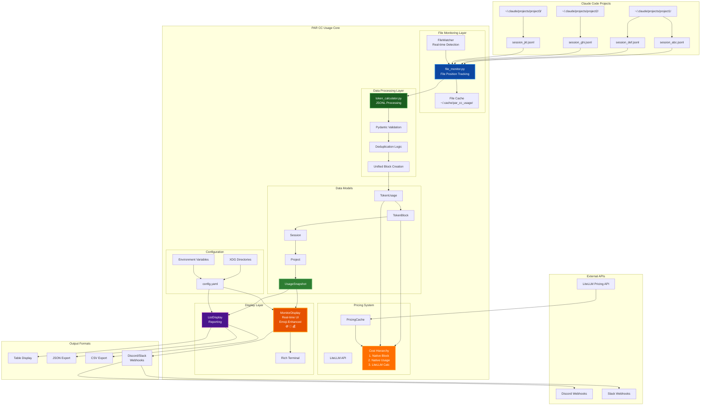

# Architecture Documentation

This document provides detailed information about the system architecture, data models, and design decisions for PAR CC Usage.

## Table of Contents
- [Overview](#overview)
- [System Architecture Diagram](#system-architecture-diagram)
- [Core Components](#core-components)
  - [Data Flow Pipeline](#data-flow-pipeline)
  - [Unified Block System](#unified-block-system)
  - [Enhanced Configuration System](#enhanced-configuration-system)
  - [Comprehensive Command Structure](#comprehensive-command-structure)
  - [Advanced Analytics](#advanced-analytics)
  - [Monitor Display Stability](#monitor-display-stability)
- [Key Architectural Decisions](#key-architectural-decisions)
- [Data Model Relationships](#data-model-relationships)
- [Pricing System Architecture](#pricing-system-architecture)
  - [Core Components](#core-components-1)
  - [Async Cost Calculation System](#async-cost-calculation-system)
  - [Fallback Logic Hierarchy](#fallback-logic-hierarchy)
  - [Integration Points](#integration-points)
  - [Burn Rate Cost Estimation](#burn-rate-cost-estimation)
- [Critical File Interactions](#critical-file-interactions)
  - [Monitor Mode Data Flow](#monitor-mode-data-flow)
  - [List Command Cost Flow](#list-command-cost-flow)
  - [Unified Block Selection Algorithm](#unified-block-selection-algorithm)
- [XDG Base Directory Implementation](#xdg-base-directory-implementation)
  - [Directory Structure](#directory-structure)
  - [XDG Module](#xdg-module-xdgdirspy)
  - [Legacy Migration Process](#legacy-migration-process)
  - [Environment Variable Support](#environment-variable-support)
  - [Benefits](#benefits)
- [Related Documentation](#related-documentation)

## Overview

PAR CC Usage is a sophisticated token usage monitoring system built to track and analyze Claude Code usage patterns. It employs a unified block system that accurately reflects Claude's 5-hour billing periods, providing real-time monitoring, cost tracking, and comprehensive analytics.

## System Architecture Diagram



## Core Components

### Data Flow Pipeline

- **`file_monitor.py`**: Watches Claude project directories for JSONL file changes using file position tracking
- **`token_calculator.py`**: Parses JSONL lines and calculates token usage per 5-hour blocks with deduplication
- **`models.py`**: Core data structures (TokenUsage, TokenBlock, Session, Project, UsageSnapshot) with timezone support
- **`display.py`**: Rich-based terminal UI for real-time monitoring with burn rate analytics, cost tracking, emoji-enhanced formatting (🪙 tokens, 💬 messages, 💰 costs), and stable console output (no jumping or interruptions)
- **`pricing.py`**: LiteLLM integration for accurate cost calculations across all Claude models

### Unified Block System

The unified billing block calculation uses an activity-based approach to identify the current billing period:

- **Activity-Based Block Selection**: Current billing block is determined by finding the earliest active block with recent activity
- **Consistent Start Times**: All blocks start at the top of the hour in UTC for predictable billing periods
- **Manual Override**: CLI `--block-start HOUR` option for testing and corrections (hour 0-23)
- Logic in `token_calculator.py:create_unified_blocks()` function provides accurate billing block identification
- Debug with `pccu debug-unified` to see block selection details
- Automatic gap detection for inactivity periods > 5 hours

#### Unified Block Algorithm

The `create_unified_blocks()` function implements an activity-based approach:

1. **Check Data Availability**: Verifies that projects contain usage data
2. **Find Active Blocks**: Scans all projects and sessions to find currently active blocks
3. **Activity Validation**: Checks each block using `_is_block_active()` logic:
   - Not a gap block
   - Current time < block end time (start + 5 hours)
   - Time since last activity < 5 hours
4. **Return Earliest Active**: Returns the start time of the earliest active block

**Block Activity Logic**: Individual session blocks are active if:
- Time since last activity < 5 hours (session duration)
- Current time < block end time (start + 5 hours)

**Key Architectural Decision**: This approach ensures accurate billing period representation by finding the actual active block with recent activity, providing precise billing block identification that matches real usage patterns rather than just current time.

### Enhanced Configuration System

- **`config.py`**: Pydantic-based configuration with structured environment variable parsing
- **`xdg_dirs.py`**: XDG Base Directory specification compliance for proper file organization
- **`enums.py`**: Centralized type-safe enums for all string-based configurations
- **`options.py`**: Structured dataclasses for command-line option management
- Config precedence: Environment vars > Config file > Defaults
- Auto-saves token limit adjustments when exceeded
- **XDG Compliance**: Config, cache, and data files stored in standard Unix/Linux locations
- **Legacy Migration**: Automatic migration of existing config files to XDG locations
- **Timezone Support**: Full timezone handling with configurable display formats via `TimeFormat` enum
- **Display Customization**: Type-safe configuration options with validation

### Comprehensive Command Structure

- **`main.py`**: Typer CLI app with main commands (monitor, list, init, etc.)
- **`commands.py`**: Debug and analysis commands (debug-blocks, debug-unified, debug-activity, etc.)
- **`list_command.py`**: Specialized listing and reporting functionality with multiple output formats and pricing integration
- **Notification System**: Discord and Slack webhook integration for block completion alerts
- **Pricing Integration**: Cost calculations available in both monitor and list modes with `--show-pricing` flag

### Advanced Analytics

- **Burn Rate Calculation**: Tokens per minute tracking with ETA estimation
- **Block Progress Tracking**: Real-time 5-hour block progress with visual indicators
- **Model Usage Analysis**: Per-model token breakdown (Opus, Sonnet, Haiku)
- **Tool Usage Tracking**: Track and display Claude Code tool usage (Read, Edit, Bash, etc.) with counts (enabled by default)
- **Activity Pattern Detection**: Historical usage analysis with configurable time windows

### Monitor Display Stability

- **Clean Console Output**: Automatic suppression of disruptive messages during monitor mode
- **Debug Mode Integration**: Debug logging uses `NullHandler` to prevent console jumping
- **Error Handling**: File processing errors are logged silently without disrupting the display
- **Token Limit Updates**: Token limit exceeded messages are suppressed in continuous monitor mode
- **Exception Resilience**: Monitor loop exceptions are logged without breaking the display interface
- **Stable Interface**: No console jumping or text interruptions during real-time monitoring

## Key Architectural Decisions

1. **Activity-Based Block Logic**: Billing block selection uses activity-based detection to find the earliest active block with recent usage, providing accurate billing period representation that matches real usage patterns
2. **XDG Base Directory Compliance**: Configuration, cache, and data files follow XDG specification for proper system integration
3. **Legacy Migration Support**: Automatic detection and migration of existing config files to XDG locations
4. **Deduplication**: Uses message IDs and request IDs to prevent double-counting tokens when files are re-read
5. **Single FileMonitor Architecture**: Uses one FileMonitor instance throughout the entire monitoring process to maintain cache consistency and prevent state conflicts
   - **Consistent Cache State**: Initial scan and live monitoring share the same FileMonitor instance
   - **Eliminated Race Conditions**: No more dual-instance cache conflicts that caused timing issues
   - **Immediate Data Display**: Cache provides instant, accurate data without delays
   - **Shared File State**: Both operations use the same file position tracking for consistency
6. **File Monitoring Cache**: High-performance cache system tracks file positions to avoid re-processing entire files (stored in XDG cache directory)
   - **Enabled by Default**: Monitor mode uses cache for fast startup (0.3s vs 3.9s without cache)
   - **Smart Cache Usage**: Initial scan respects cache setting for dramatic performance improvement
   - **Cache Override**: Use `--no-cache` flag to force full file processing when needed
   - **Position Tracking**: Stores last read position for each JSONL file to process only new content
   - **File State Management**: Tracks modification times, file sizes, and processing timestamps
7. **Timezone Handling**: All internal times are UTC, converted to configured timezone for display
8. **Model Normalization**: Maps various Claude model names to simplified display names via `ModelType` enum
9. **Per-Model Token Tracking**: TokenBlocks track adjusted tokens per model with multipliers applied (Opus 5x, others 1x)
10. **Tool Usage Extraction**: Always parses JSONL message content arrays to extract tool_use blocks and track tool names and call counts (displayed by default, can be toggled instantly)
11. **Structured JSON Validation**: Uses Pydantic models for type-safe JSONL parsing and validation
12. **Type-Safe Configuration**: Centralized enums and structured dataclasses eliminate string-based configurations
13. **Console Stability**: Monitor mode suppresses all disruptive output (errors, debug messages, notifications) to maintain clean, stable real-time display
14. **Emoji-Enhanced UX**: Visual icons (🪙 💬 💰) improve readability and user experience in terminal interfaces
15. **Individual Block Cost Tracking**: Cost maximums track single block peaks, not cumulative totals, for accurate billing representation

## Data Model Relationships

```mermaid
graph TD
    US[UsageSnapshot] --> P1[Project: par-cc-usage]
    US --> P2[Project: my-app]
    US --> P3[Project: ...]

    P1 --> S1[Session: abc123...]
    P1 --> S2[Session: def456...]
    P2 --> S3[Session: ghi789...]

    S1 --> TB1[TokenBlock: 14:00-19:00]
    S1 --> TB2[TokenBlock: 20:00-01:00]
    S2 --> TB3[TokenBlock: 09:00-14:00]

    TB1 --> TU1[TokenUsage: msg1]
    TB1 --> TU2[TokenUsage: msg2]
    TB1 --> TU3[TokenUsage: msg3]
    TB1 --> MT1[model_tokens: {opus: 150K, sonnet: 75K}]
    TB1 --> CC1[cost_usd: 12.50]

    TB2 --> TU4[TokenUsage: msg4]
    TB2 --> MT2[model_tokens: {sonnet: 200K}]
    TB2 --> CC2[cost_usd: null]

    TU1 --> TUC1[cost_usd: 2.50]
    TU2 --> TUC2[cost_usd: null]
    TU3 --> TUC3[cost_usd: 4.75]

    US -.-> UBT[unified_block_tokens\(\)]
    US -.-> UBTM[unified_block_tokens_by_model\(\)]
    US -.-> UBST[unified_block_start_time]

    style US fill:#2e7d32,stroke:#66bb6a,stroke-width:2px,color:#ffffff
    style TB1 fill:#ff6f00,stroke:#ffa726,stroke-width:2px,color:#ffffff
    style TB2 fill:#ff6f00,stroke:#ffa726,stroke-width:2px,color:#ffffff
    style TB3 fill:#ff6f00,stroke:#ffa726,stroke-width:2px,color:#ffffff
    style TU1 fill:#1b5e20,stroke:#4caf50,stroke-width:2px,color:#ffffff
    style TU2 fill:#1b5e20,stroke:#4caf50,stroke-width:2px,color:#ffffff
    style TU3 fill:#1b5e20,stroke:#4caf50,stroke-width:2px,color:#ffffff
    style TU4 fill:#1b5e20,stroke:#4caf50,stroke-width:2px,color:#ffffff
```

**Key Relationships**:
- `UsageSnapshot` aggregates everything and provides unified block calculations
- `Projects` contain multiple sessions, each with 5-hour token blocks
- `TokenBlocks` track both individual `TokenUsage` messages and aggregated `model_tokens`
- Cost data can exist at both TokenBlock level (`cost_usd`) and TokenUsage level
- Unified block methods filter data to current 5-hour billing window

## Pricing System Architecture

The pricing system (`pricing.py`) provides accurate cost calculations with robust fallback handling:

### Core Components

- **PricingCache**: Async cache for LiteLLM pricing data with intelligent fallback logic
- **ModelPricing**: Pydantic model for structured pricing data validation
- **TokenCost**: Result structure for cost calculations with detailed breakdown

### Async Cost Calculation System

The system now includes **async cost calculation methods** for real-time cost display:

- **`UsageSnapshot.get_unified_block_project_cost()`**: Calculates project-specific costs from unified block entries
- **`UsageSnapshot.get_unified_block_cost_by_model()`**: Provides cost breakdown by model for unified blocks
- **`UsageSnapshot.get_unified_block_total_cost()`**: Returns total cost for the current unified block
- **Display Integration**: `display.py` uses async cost methods for accurate cost display in activity panels

### Fallback Logic Hierarchy

1. **Direct Match**: Exact model name lookup in LiteLLM pricing cache
2. **Variation Matching**: Tests common Claude model name patterns (e.g., `anthropic/claude-*`)
3. **Fuzzy Matching**: Partial string matching for similar model names
4. **Pattern-Based Fallbacks**:
   - Models containing "opus" → Claude Opus pricing
   - Models containing "sonnet" → Claude Sonnet pricing
   - Models containing "haiku" → Claude Haiku pricing
5. **Generic Claude Fallback**: Any Claude model → Sonnet pricing as safe default
6. **Unknown Model Handling**: Models marked as "Unknown" → $0.00 cost

### Integration Points

- **Monitor Display Integration**: Cost columns automatically added to activity tables when `show_pricing` enabled
- **Real-time Cost Calculation**: Activity tables now display actual calculated costs instead of stored cost values (Fixed: Cost columns no longer show "-" or $0.00)
- **List Command Integration**: Cost information included in table, JSON, and CSV outputs with `--show-pricing` flag
- **Burn Rate Cost Estimation**: Real-time 5-hour block cost projection in burn rate line based on current spending rate
- **Async Architecture**: All pricing operations are async to prevent UI blocking
- **Error Resilience**: Pricing failures don't break functionality, gracefully fall back to no-cost display
- **Debug Support**: `debug_model_pricing()` function for troubleshooting pricing issues

### Burn Rate Cost Estimation

The burn rate cost estimation provides intelligent cost projection for 5-hour billing blocks:

1. **Cost Per Minute Calculation**: `current_cost / elapsed_minutes` - calculates spending rate based on actual usage
2. **5-Hour Projection**: `cost_per_minute * 60 * 5.0` - projects cost for full billing block
3. **Display Integration**: Added to burn rate line when `show_pricing` enabled
4. **Async Implementation**: `_calculate_burn_rate()` method made async to support cost calculations
5. **Sync Compatibility**: `_calculate_burn_rate_sync()` method for non-pricing contexts
6. **Graceful Fallback**: Cost estimation failures don't break burn rate display

**Display Format**: `"🪙 531K/m 💬 5/m  Est: 🪙 159.3M (90%) 💬 1,742  💰 $65.51  ETA: 2h 28m"`
- Emoji-enhanced format: 🪙 token burn rate + 💬 message rate + 🪙 estimated tokens + 💬 estimated messages + 💰 estimated cost + ETA

## Critical File Interactions

### Monitor Mode Data Flow

```mermaid
graph LR
    A[main.py:monitor\(\)] --> B[xdg_dirs.py:get_config_file_path\(\)]
    B --> C[config.py:load_config\(\)]
    C --> D[main.py:_apply_command_overrides\(\)]
    D --> E[file_monitor.py:poll_files\(\)]
    E --> F[token_calculator.py:process_jsonl_line\(\)]
    F --> G[token_calculator.py:aggregate_usage\(\)]
    G --> H[display.py:MonitorDisplay.update\(\)]

    E --> E1[XDG Cache:\nfile_states.json]
    F --> F1[Pydantic Validation]
    G --> G1[UsageSnapshot Creation]
    H --> H1[Rich Terminal UI]

    style A fill:#e65100,stroke:#ff9800,stroke-width:3px,color:#ffffff
    style E fill:#0d47a1,stroke:#2196f3,stroke-width:2px,color:#ffffff
    style F fill:#1b5e20,stroke:#4caf50,stroke-width:2px,color:#ffffff
    style G fill:#2e7d32,stroke:#66bb6a,stroke-width:2px,color:#ffffff
    style H fill:#4a148c,stroke:#9c27b0,stroke-width:2px,color:#ffffff
```

### List Command Cost Flow

```mermaid
graph TD
    A[pccu list --show-pricing] --> B[list_command.py:display_usage_list\(\)]
    B --> C[ListDisplay.__init__\(show_pricing=True\)]
    C --> D[ListDisplay.display_table\(\) / export_json\(\) / export_csv\(\)]
    D --> E["Loop: For each TokenBlock"]
    E --> F[ListDisplay._calculate_block_cost\(\)]
    F --> G{"Cost Hierarchy Decision"}

    G -->|Priority 1| H["block.cost_usd exists & valid"]
    G -->|Priority 2| I["block.token_usage.cost_usd exists & valid"]
    G -->|Priority 3| J["pricing.calculate_token_cost\(\)"]

    H --> K["Return block.cost_usd"]
    I --> L["Return usage.cost_usd"]
    J --> M["LiteLLM API Call"]
    M --> N["Return calculated cost"]

    K --> O["Display/Export with cost_source"]
    L --> O
    N --> O

    style A fill:#e65100,stroke:#ff9800,stroke-width:3px,color:#ffffff
    style F fill:#0d47a1,stroke:#2196f3,stroke-width:2px,color:#ffffff
    style G fill:#ff6f00,stroke:#ffa726,stroke-width:2px,color:#ffffff
    style H fill:#1b5e20,stroke:#4caf50,stroke-width:2px,color:#ffffff
    style I fill:#1b5e20,stroke:#4caf50,stroke-width:2px,color:#ffffff
    style J fill:#4a148c,stroke:#9c27b0,stroke-width:2px,color:#ffffff
```

### Unified Block Selection Algorithm

```mermaid
graph TD
    A[token_calculator.py:create_unified_blocks\(\)] --> B["Check if projects contain usage data"]
    B --> C{"Has data?"}
    C -->|Yes| D["Get current UTC time"]
    C -->|No| E["Return None"]

    D --> F["Floor time to hour using calculate_block_start\(\)"]
    F --> G["Return hour-floored start time"]

    G --> H["UsageSnapshot.unified_block_start_time property"]
    H --> I["Used by unified_block_tokens\(\) methods"]

    style A fill:#e65100,stroke:#ff9800,stroke-width:3px,color:#ffffff
    style D fill:#0d47a1,stroke:#2196f3,stroke-width:2px,color:#ffffff
    style F fill:#1b5e20,stroke:#4caf50,stroke-width:2px,color:#ffffff
    style G fill:#2e7d32,stroke:#66bb6a,stroke-width:2px,color:#ffffff
```

## XDG Base Directory Implementation

### Directory Structure

PAR CC Usage implements the XDG Base Directory Specification for proper file organization:

- **Config Directory**: `~/.config/par_cc_usage/` (respects `XDG_CONFIG_HOME`)
  - `config.yaml` - Main configuration file
- **Cache Directory**: `~/.cache/par_cc_usage/` (respects `XDG_CACHE_HOME`)
  - `file_states.json` - File monitoring cache
- **Data Directory**: `~/.local/share/par_cc_usage/` (respects `XDG_DATA_HOME`)
  - Reserved for future application data

### XDG Module (xdg_dirs.py)

Provides utilities for XDG-compliant directory management:

- `get_config_dir()` - Returns XDG config directory
- `get_cache_dir()` - Returns XDG cache directory  
- `get_data_dir()` - Returns XDG data directory
- `get_config_file_path()` - Returns full path to config file
- `ensure_xdg_directories()` - Creates necessary directories
- `migrate_legacy_config()` - Migrates legacy config files
- `get_legacy_config_paths()` - Returns potential legacy config locations

### Legacy Migration Process

1. **Detection**: Checks for existing config files in legacy locations:
   - `./config.yaml` (current working directory)
   - `~/.par_cc_usage/config.yaml` (home directory)

2. **Migration**: If legacy config exists and XDG config doesn't:
   - Creates XDG config directory if needed
   - Copies legacy config to XDG location
   - Preserves all existing settings
   - Returns `True` if migration performed

3. **Integration**: Migration happens automatically in `config.py:_load_config_file()`:
   - Called during normal config loading process
   - No user intervention required
   - Seamless transition from legacy to XDG locations

### Environment Variable Support

Respects standard XDG environment variables:

- `XDG_CONFIG_HOME` - Override config directory (default: `~/.config`)
- `XDG_CACHE_HOME` - Override cache directory (default: `~/.cache`)
- `XDG_DATA_HOME` - Override data directory (default: `~/.local/share`)

### Benefits

- **System Integration**: Follows Unix/Linux conventions for better system integration
- **User Expectation**: Config files where users expect them (`~/.config/`)
- **Backup Compatibility**: Standard locations are included in most backup solutions
- **Multi-user Support**: Proper isolation of user-specific data
- **Package Manager Friendly**: Standard locations for distribution packaging

## Related Documentation

- [Configuration Guide](CONFIGURATION.md) - Detailed configuration options and settings
- [Development Guide](DEVELOPMENT.md) - Development workflows and advanced features
- [Display Features](DISPLAY_FEATURES.md) - Display modes, themes, and customization
- [Features](FEATURES.md) - Complete feature overview and capabilities
- [Troubleshooting Guide](TROUBLESHOOTING.md) - Cache system, debugging, and problem resolution
- [Usage Guide](USAGE_GUIDE.md) - Common usage patterns and examples
