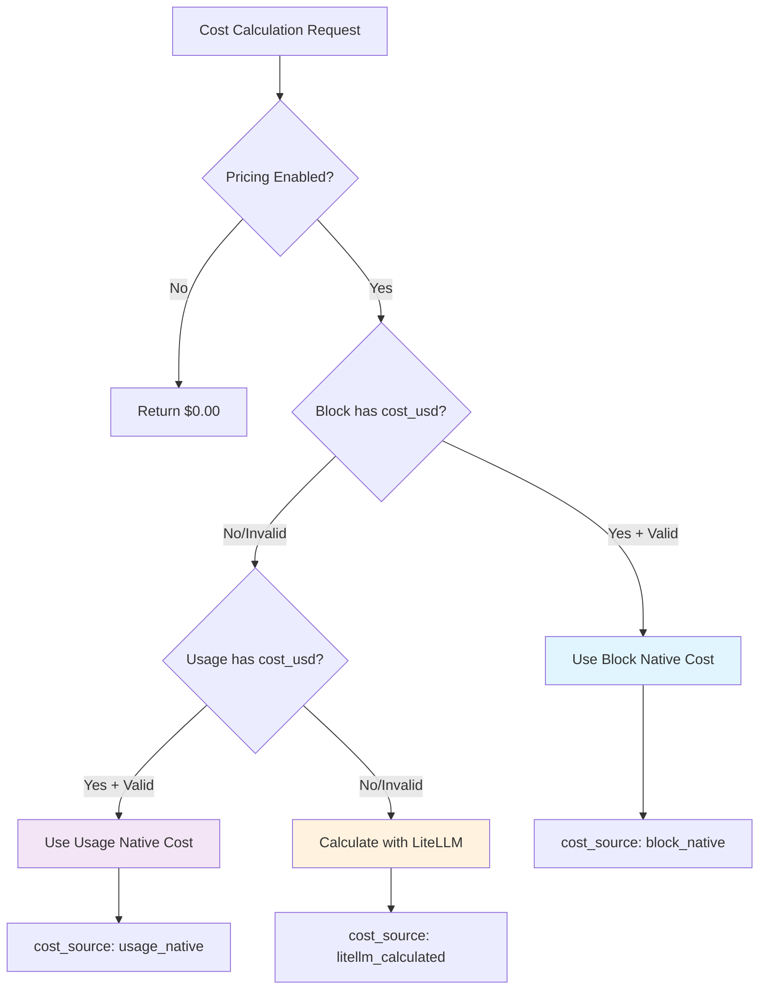

# Development Guide

This document provides detailed development workflows, advanced features, and implementation guidance for PAR CC Usage.

## Development Workflows

### Tool Usage Display (Default Enabled)

PAR CC Usage now displays Claude Code tool usage by default, providing insights into which tools (Read, Edit, Bash, etc.) are being used most frequently.

**Display Format**: Tool names appear in orange color, with usage totals in cyan parentheses for easy visual distinction:
- Example: `Read, Edit, Bash (25)` - where "Read, Edit, Bash" is orange and "(25)" is cyan

```bash
# Default behavior - tool usage displayed automatically
uv run pccu monitor

# Disable tool usage display if desired
uv run pccu monitor --no-tools

# Explicitly enable tool usage (redundant with new defaults)
uv run pccu monitor --show-tools

# Tool usage in snapshot mode for quick debugging
uv run pccu monitor --snapshot     # Shows tools by default
uv run pccu monitor --no-tools --snapshot  # Hides tools

# Tool usage is always tracked in cache - instant toggle without rebuilds
# Switch between modes instantly:
uv run pccu monitor --show-tools --snapshot  # Instant display
uv run pccu monitor --no-tools --snapshot    # Instant hide
uv run pccu monitor --show-tools --snapshot  # Instant display again
```

**Key Benefits:**
- **Always Tracked**: Tool usage data is cached regardless of display settings
- **Zero Performance Impact**: Toggling display on/off processes only new messages
- **Instant Toggle**: Switch between `--show-tools`/`--no-tools` without cache rebuilds
- **Rich Information**: See which tools are used most frequently across projects and sessions

### Tool Usage Testing

Tool usage tracking is now always enabled in the cache with display enabled by default for immediate insights.

```bash
# Default behavior - tool usage displayed automatically (NEW DEFAULT)
uv run pccu monitor --snapshot

# Disable tool usage display when desired
uv run pccu monitor --no-tools --snapshot

# Explicitly enable (redundant with new defaults, but still supported)
uv run pccu monitor --show-tools --snapshot

# Performance testing - instant toggle without cache rebuilds
uv run pccu monitor --show-tools --snapshot  # ~0.3s (only new messages)
uv run pccu monitor --no-tools --snapshot    # ~0.3s (only new messages)
uv run pccu monitor --show-tools --snapshot  # ~0.3s (only new messages)

# Compare with old behavior (forcing full rebuild)
uv run pccu monitor --no-cache --snapshot    # ~3.9s (all 40,000+ messages)
```

**Performance Improvements:**
- **12x Faster Startup**: Tool display toggle processes 1-2 new messages vs 40,000+ previously
- **Always Ready**: Tool data cached regardless of display preference
- **Zero Rebuild Cost**: Cache metadata tracks tool usage state automatically

### Cost Analysis (Default Enabled)

PAR CC Usage displays comprehensive cost information by default, providing insights into Claude Code API spending and budget tracking.

**Display Features**: Real-time cost tracking with 💰 emoji indicators throughout the interface:
- Token usage costs in monitor display
- Burn rate cost estimation for 5-hour blocks
- Individual project/session cost breakdown
- Cost totals and maximums tracking

```bash
# Default behavior - pricing displayed automatically
uv run pccu monitor

# Disable pricing display if desired  
uv run pccu monitor --no-pricing

# Pricing in list mode for detailed cost analysis
uv run pccu list                # Shows costs by default
uv run pccu list --no-pricing   # Hides cost information

# Export cost data for analysis
uv run pccu list --format json --output costs.json
uv run pccu list --format csv --output costs.csv
```

### Debug Commands

```bash
# Debug unified block calculation
uv run pccu debug-unified

# Debug block information
uv run pccu debug-blocks --show-inactive

# Test webhooks (Discord/Slack)
uv run pccu test-webhook

# Take a single debug snapshot (monitor once and exit)
uv run pccu monitor --snapshot

# Enable debug output (debug messages are suppressed in monitor mode to maintain clean display)
uv run pccu monitor --debug

# Note: Debug output is automatically suppressed during continuous monitor mode
# to prevent console jumping and maintain a clean, stable display interface

# Tool usage display is enabled by default - disable with --no-tools
uv run pccu monitor --no-tools --snapshot

# Test pricing functionality including burn rate cost estimation
uv run pccu monitor --show-pricing --snapshot
uv run pccu list --show-pricing

# Test pricing with different output formats
uv run pccu list --show-pricing --format json
uv run pccu list --show-pricing --format csv --output usage_with_costs.csv

# Debug pricing fallbacks (using Python directly)
uv run python -c "
import asyncio
from src.par_cc_usage.pricing import debug_model_pricing, calculate_token_cost

async def test():
    # Test unknown model handling
    info = await debug_model_pricing('Unknown')
    cost = await calculate_token_cost('Unknown', 1000, 500)
    print(f'Unknown model: \${cost.total_cost}, info: {info}')

    # Test fallback pricing
    cost = await calculate_token_cost('claude-opus-custom', 1000, 500)
    print(f'Custom opus model cost: \${cost.total_cost}')

asyncio.run(test())
"

# Test burn rate cost estimation specifically
uv run pytest tests/test_display.py -k "test_calculate_burn_rate" -v
```

## Advanced Features

### List Command Pricing Integration

The `pccu list` command supports comprehensive cost analysis with the `--show-pricing` flag:

#### Intelligent Cost Calculation Hierarchy



- **Priority 1**: Native cost data from TokenBlock (`cost_usd` field) when available
- **Priority 2**: Native cost data from TokenUsage (`cost_usd` field) when block cost unavailable  
- **Priority 3**: LiteLLM calculation using cached pricing data (fallback)
- **Validation**: Native cost data is validated for reasonableness ($0.01-$1000.00) before use

#### Cost Source Transparency

All exports include `cost_source` field indicating calculation method:
- `"block_native"`: Cost from TokenBlock native data (future-ready)
- `"usage_native"`: Cost from TokenUsage native data (future-ready)
- `"litellm_calculated"`: Cost calculated using LiteLLM pricing (current default)

#### Output Format Support

- **Table Display**: Adds a "Cost" column showing dollar amounts for each billing block
- **JSON Export**: Includes `cost` and `cost_source` fields in each block's data structure  
- **CSV Export**: Adds "Cost" and "Cost Source" columns to CSV headers and data rows
- **Async Integration**: All cost calculations are performed asynchronously to maintain performance

#### Usage Examples

```bash
# Display usage with costs in table format
pccu list --show-pricing

# Export usage data with costs as JSON
pccu list --show-pricing --format json

# Export usage data with costs as CSV  
pccu list --show-pricing --format csv --output usage_costs.csv

# Combine with sorting and formatting
pccu list --show-pricing --sort-by time --format table
```

#### JSON Output Structure (with pricing)

```json
[
  {
    "project": "par-cc-usage",
    "session": "abc123...",
    "model": "opus",
    "tokens": 142465091,
    "active": false,
    "cost": 12.68517,
    "cost_source": "litellm_calculated"
  }
]
```

### Cost Calculation Future-Proofing

- When Claude begins providing native cost data in JSONL files, the system automatically prefers it
- Current implementation falls back to LiteLLM calculations ensuring backward compatibility
- Cost source tracking enables transparency and debugging of cost calculation methods

## Implementation Details

### Token Block Logic

- Blocks are 5 hours long, starting from the hour of first activity (UTC hour-floored)
- New blocks are created when: time since block start > 5 hours OR time since last activity > 5 hours
- Gap blocks are inserted for periods of inactivity > 5 hours
- **Current Block Selection**: Uses simple hour-flooring of current UTC time for consistent and predictable billing representation
- **Per-Model Token Tracking**: Each block maintains a `model_tokens` dictionary that tracks adjusted tokens per model with multipliers applied during token processing

### File Processing

- **High-Performance Cache**: Only processes new lines added to JSONL files using file position tracking for 12x faster startup
- **Smart Cache Management**: Monitor mode uses cache by default (0.3s startup) with `--no-cache` override for full processing (3.9s)
- **Multi-Directory Support**: Handles multiple Claude project directories (legacy and new paths)
- **XDG Cache Storage**: File monitoring cache stored in `~/.cache/par_cc_usage/file_states.json`
- **Legacy Migration**: Automatic detection and migration of config files from current directory to XDG locations
- **Incremental Processing**: Cache tracks file modifications and processes only new content since last run

### Display Formatting

- **Emoji-Enhanced Interface**: Uses visual icons for improved readability
  - 🪙 for tokens, 💬 for messages, 💰 for costs
  - ⚡ for Sonnet model, 🔥 for burn rate, 📊 for totals
- **Real-Time Current Time**: Displays current time in bright orange (#FF8800) in monitor header
- **Abbreviated Counts**: Token counts use format (e.g., "1.2M" for millions)
- **Time Formats**: Configurable (12h/24h) display options for both current time and block ranges
- **Project Names**: Prefixes can be stripped for cleaner display
- **Cost Tracking**: Individual block maximums (not cumulative totals)
- **Tool Usage Display**: Enabled by default with instant toggle via `--no-tools`
- **Cost Tracking Display**: Enabled by default with toggle via `--no-pricing`

### Console Stability in Monitor Mode

- **Output Suppression**: All disruptive console output is automatically suppressed during continuous monitor mode
- **Debug Logging**: Uses `NullHandler` to prevent debug messages from interrupting the display when `--debug` is enabled
- **Error Handling**: File processing errors are logged silently without breaking the display interface
- **Token Limit Messages**: Token limit exceeded notifications are suppressed in monitor mode but still shown in snapshot mode
- **Exception Resilience**: Monitor loop exceptions use logging instead of console output to maintain display stability
- **Clean Interface**: Ensures no console jumping, text interruptions, or display artifacts during real-time monitoring

### Enhanced Display System

- **Emoji-Enhanced Formatting**: Visual icons for better readability
  - 🪙 **Tokens**: Represents token counts and rates
  - 💬 **Messages**: Represents message counts and rates
  - 💰 **Costs**: Represents cost calculations and estimates
  - ⚡ **Models**: Lightning for Claude Sonnet, other emojis for different models
  - 🔥 **Burn Rate**: Fire emoji for activity rate calculations
  - 📊 **Total**: Bar chart emoji for summary statistics

- **Tool Usage Color Scheme**: Enhanced visual distinction for tool display
  - **Tool Names**: Orange color (#FF9900) for tool names (Read, Edit, Bash, etc.)
  - **Tool Totals**: Cyan color (#00FFFF) for usage counts in parentheses
  - **Example**: `Read, Edit, Bash (25)` where tools are orange and "(25)" is cyan

**Example Monitor Display Format**:
```
│ ⚡ Sonnet  🪙 10.8M - 💬 118 - 💰 $5.33                                       │
│ 🔥 Burn        🪙 532K/m 💬 5/m  Est: 🪙 159.7M ( 38%) 💬 1,742  💰 $78.69     │
│ 📊 Total         3%    🪙 10.8M / 78.3M - 💬 118 / 917 - 💰 $5.33 / $56.02 │
```

### Notification System

- Discord and Slack webhooks for block completion notifications
- Tracks sent notifications to avoid duplicates
- Configurable cooldown between notifications

## Code Quality Standards

### Complexity Management

All functions maintain cyclomatic complexity ≤ 10 through systematic refactoring:
- Extraction of helper functions for specific responsibilities
- Clear separation of concerns (e.g., data collection vs. processing)
- Use of early returns to reduce nesting
- Functional decomposition of complex operations

### Recent Code Quality Improvements (2025)

#### Tool Usage Default Enablement (2025-07-15)
Made tool usage display the default behavior with zero performance impact:
- **Feature**: Tool usage tracking now enabled by default in both CLI and configuration
- **CLI Enhancement**: Updated to use `--show-tools/--no-tools` pattern with `True` default
- **Cache Optimization**: Tool usage always tracked in cache regardless of display settings
- **Performance**: Zero cost toggle - switching display modes processes only new messages (1-2 vs 40,000+)
- **User Experience**: Immediate insights into Claude Code tool usage patterns without configuration
- **Backward Compatibility**: `--no-tools` available for users who prefer minimal display

#### Code Complexity Reduction (2025-07-15)
Fixed cyclomatic complexity violations in core functions:
- **Issue**: `_auto_update_max_cost()` function exceeded complexity limit (11 > 10)
- **Solution**: Refactored into focused helper functions with single responsibilities:
  - `_calculate_block_cost()`: Calculate cost for individual blocks
  - `_find_max_block_cost()`: Scan all blocks for maximum cost
  - `_save_max_cost_update()`: Handle config updates and user notifications
- **Result**: All functions now ≤10 complexity, improved maintainability and testability
- **Quality**: All code quality checks pass (ruff format, ruff check, pyright)

#### Current Time Display Enhancement (2025-07-15)
Added real-time current time display to monitor interface:
- **Feature**: Added current time display to monitor header row alongside Active Projects and Sessions
- **Design**: Time-only format (no date) with bright orange color (#FF8800) for high visibility
- **Implementation**: Integrated into existing header panel using `format_time()` utility with timezone support
- **Layout**: Removed redundant max value information from header for cleaner display
- **Result**: Users can easily distinguish current time from billing block time ranges

#### Tool Usage Color Enhancement (2025-07-15)
Improved visual distinction for tool usage totals in Projects with Activity section:
- **Feature**: Tool usage totals in parentheses now display in different color from tool names
- **Design**: Tool names remain orange (#FF9900), totals displayed in cyan (#00FFFF) for better contrast
- **Implementation**: Added `tool_total` color to all theme definitions and updated display logic across project/session views
- **User Experience**: Easier visual scanning to quickly identify total tool call counts
- **Example**: `Read, Edit, Bash (25)` where "Read, Edit, Bash" is orange and "(25)" is cyan

#### Pricing Display Default Enablement (2025-07-15)
Made cost tracking display the default behavior for better financial awareness:
- **Feature**: Pricing information now shown by default in both monitor and list commands
- **CLI Enhancement**: Updated to use `--show-pricing/--no-pricing` pattern with `True` default
- **Configuration**: Changed `show_pricing` default from `False` to `True` in DisplayConfig
- **User Experience**: Immediate cost insights without configuration, helping users track API spending
- **Backward Compatibility**: `--no-pricing` available for users who prefer cost-free display
- **Fix**: Corrected command override logic to properly handle both enable and disable flags

#### Cache Performance Optimization (2025-07-15)
Fixed file monitoring cache to dramatically improve startup performance:
- **Issue**: Monitor mode initial scan always used `use_cache=False`, processing all 40,000+ messages every startup
- **Solution**: Changed initial scan to respect cache setting: `use_cache=not config.disable_cache`
- **Performance Impact**:
  - **With cache**: 0.3 seconds startup (processes only new messages)
  - **Without cache**: 3.9 seconds startup (processes all messages)
  - **Improvement**: 12x faster startup time when cache is enabled
- **Validation**: Cache properly tracks file positions and processes only incremental changes
- **Backward Compatibility**: `--no-cache` flag continues to work for full data processing

#### Block Time Computation Fix (2025-07-15)
Fixed unified block time calculation to use standard behavior:
- **Issue**: `create_unified_blocks()` used simple hour-flooring of current time, ignoring actual activity
- **Solution**: Implemented activity-based block detection that finds the earliest active block with recent usage
- **Changes**:
  - Added `_is_block_active()` helper function matching TokenBlock.is_active logic
  - Modified `create_unified_blocks()` to scan all projects/sessions for active blocks
  - Now returns start time of earliest active block instead of current hour
- **Result**: Block time display now accurately reflects actual usage patterns instead of just current time
- **Validation**: Monitor display changed from incorrect "11:00 PM - 04:00 AM" to correct "09:00 PM - 02:00 AM"

#### Major Complexity Refactoring
Successfully reduced cyclomatic complexity across all core modules:

**Display Module (`display.py`)**
- **`_calculate_burn_rate()`** (11 → ≤10): Extracted cost calculation, color determination, and text formatting into separate helper functions
- **`_populate_project_table()`** (17 → ≤10): Split into table setup, data collection, cost calculation, and row formatting functions
- **`_populate_session_table()`** (12 → ≤10): Decomposed into column setup, data collection, and row formatting helpers

**Command Module (`commands.py`)**
- **`debug_session_table()`** (13 → ≤10): Extracted block overlap analysis, statistics collection, and summary display functions

**Main Module (`main.py`)**
- **`list_sessions()`** (19 → ≤10): Separated project scanning, table creation, filtering, and cost calculation
- **`debug_sessions()`** (13 → ≤10): Split into header display, table creation, block analysis, and summary functions
- **`filter_sessions()`** (36 → ≤10): Extensive decomposition into filter logic, display formatting, and output generation functions

**Benefits of Complexity Reduction**
1. **Improved Readability**: Each function has a single, clear responsibility
2. **Better Maintainability**: Changes to specific functionality are isolated
3. **Increased Testability**: Helper functions can be tested independently
4. **Code Reusability**: Common logic extracted into reusable functions
5. **Reduced Cognitive Load**: Functions are easier to understand and debug

### Key Refactored Components

- **XDG Directory Support** (`xdg_dirs.py`): Centralized XDG Base Directory specification implementation
- **Configuration Loading** (`config.py`): Separated file loading, environment parsing, nested config handling, and legacy migration
- **Monitor Function** (`main.py`): Split into initialization, token detection, and file processing helpers
- **Debug Commands** (`commands.py`): Extracted display and data collection logic with complexity-optimized helper functions
- **Block Selection** (`token_calculator.py`): Simple hour-flooring logic for consistent and predictable billing block representation
- **JSONL Processing** (`token_calculator.py`): Isolated message validation and block creation
- **Display System** (`display.py`): Modular UI components with separated rendering, calculation, and formatting logic
- **Session Management** (`main.py`): Decomposed session listing, filtering, and analysis functions

### Code Quality Metrics

- **Cyclomatic Complexity**: All functions ≤ 10 (enforced by ruff)
- **Test Coverage**: 512+ test cases covering core functionality
- **Type Safety**: Full type annotations with pyright validation
- **Code Formatting**: Consistent style with ruff formatting
- **Documentation**: Comprehensive docstrings following Google style