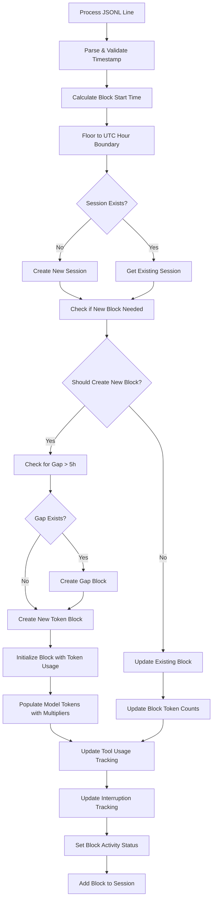
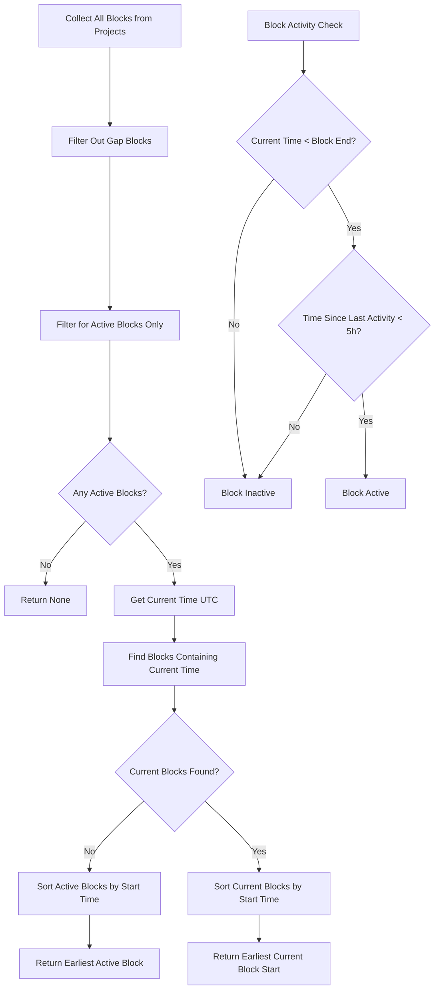
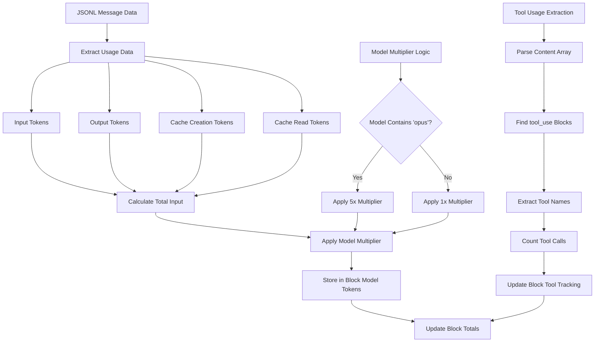
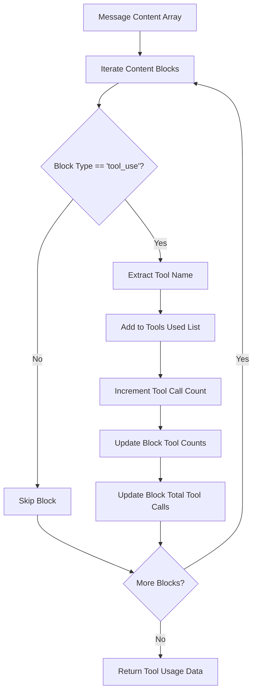
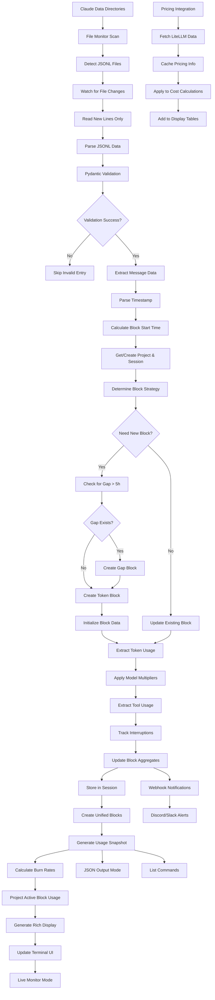
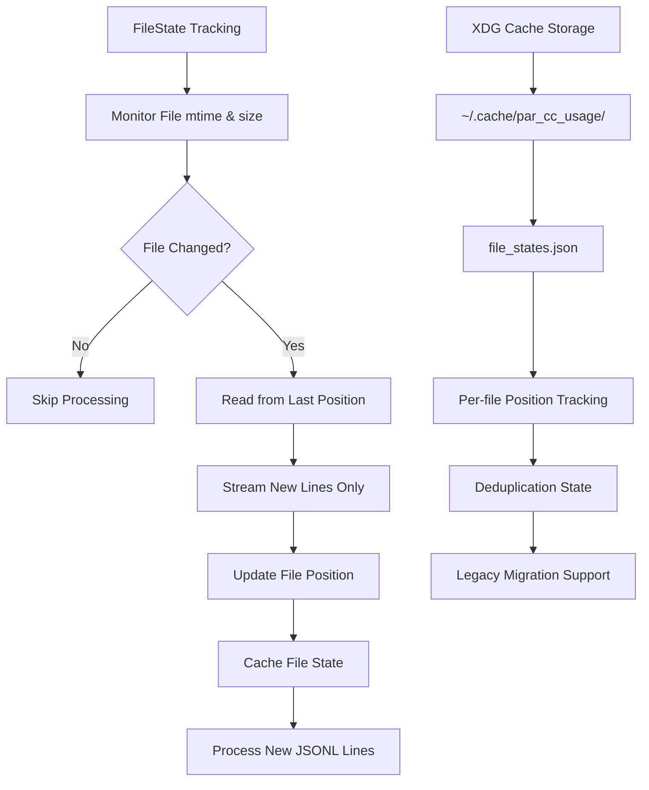
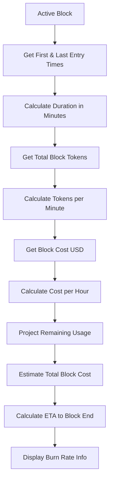
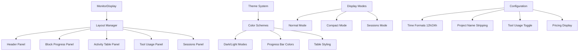

# PAR CC Usage Analysis Report

## Executive Summary

PAR CC Usage is a sophisticated Python-based CLI tool for monitoring and analyzing Claude Code token usage in real-time. Built with Python 3.12, it provides comprehensive tracking of 5-hour billing blocks, cost analysis, and extensive monitoring capabilities with Rich-based terminal interfaces.

## Architecture Overview

### Core Components

1. **Token Calculator** (`token_calculator.py`) - Core billing block and token processing logic
2. **File Monitor** (`file_monitor.py`) - JSONL file watching and streaming
3. **Pricing System** (`pricing.py`) - LiteLLM integration for cost calculations
4. **Display Engine** (`display.py`) - Rich-based terminal user interface
5. **Data Models** (`models.py`) - Comprehensive data structures with tool tracking
6. **Configuration System** (`config.py`) - XDG-compliant configuration management

## Time Block Computation Logic

### Core Algorithm

PAR CC Usage implements a sophisticated 5-hour billing block system that aligns with Claude's pricing structure:

#### Key Principles
- **5-hour session duration** - Matches Claude's billing cycle
- **UTC hour-floored start times** - Consistent block boundaries (`calculate_block_start()`)
- **Unified block selection** - Optimal algorithm for current billing period identification
- **Gap detection** - Automatic identification of inactivity periods > 5 hours
- **Active tracking** - Real-time block status determination

#### Block Creation Flow



#### Unified Block Selection Algorithm

The unified block logic implements an optimal approach for identifying the current billing period:



### Block Status Determination

```python
def is_block_active(block_start: datetime, current_time: datetime) -> bool:
    block_end = calculate_block_end(block_start)  # +5 hours
    return block_start <= current_time < block_end
```

## Token Counting Logic

### Token Types and Processing

The system tracks four distinct token types with sophisticated aggregation:

1. **Input Tokens** - User input to Claude
2. **Output Tokens** - Claude's responses
3. **Cache Creation Tokens** - Context caching creation cost
4. **Cache Read Tokens** - Context caching read optimization

### Token Aggregation Flow



### Model Multiplier System

```python
def _get_model_multiplier(model: str) -> float:
    """Opus models cost 5x more than Sonnet/Haiku."""
    if "opus" in model.lower():
        return 5.0
    return 1.0
```

### Tool Usage Tracking



## Cost Calculation Logic

### Pricing System Architecture

The pricing system provides intelligent cost calculation with robust fallback mechanisms:


### Cost Calculation Formula

```python
async def calculate_token_cost(
    model: str, 
    input_tokens: int, 
    output_tokens: int,
    cache_creation_tokens: int = 0,
    cache_read_tokens: int = 0
) -> TokenCost:
    """Calculate comprehensive token costs."""
    pricing = await _pricing_cache.get_pricing(model)
    
    input_cost = input_tokens * (pricing.input_cost_per_token or 0.0)
    output_cost = output_tokens * (pricing.output_cost_per_token or 0.0)
    cache_creation_cost = cache_creation_tokens * (pricing.cache_creation_input_token_cost or 0.0)
    cache_read_cost = cache_read_tokens * (pricing.cache_read_input_token_cost or 0.0)
    
    return TokenCost(
        input_cost=input_cost,
        output_cost=output_cost,
        cache_creation_cost=cache_creation_cost,
        cache_read_cost=cache_read_cost,
        total_cost=input_cost + output_cost + cache_creation_cost + cache_read_cost
    )
```

## Overall Data Flow



## Advanced Features

### File Monitoring System



### Deduplication Logic

```python
def get_unique_hash(token_usage: TokenUsage) -> str:
    """Create unique hash for deduplication."""
    message_id = token_usage.message_id or "no-message-id"
    request_id = token_usage.request_id or "no-request-id"
    return f"{message_id}:{request_id}"
```

### Burn Rate Calculation



## Key Technical Innovations

### XDG Base Directory Compliance

- **Config**: `~/.config/par_cc_usage/config.yaml`
- **Cache**: `~/.cache/par_cc_usage/file_states.json`
- **Data**: `~/.local/share/par_cc_usage/` (reserved)
- **Legacy Migration**: Automatic detection and migration from old locations

### Unified Block Selection Algorithm

The optimal block selection algorithm ensures consistent billing period representation:

1. **Collect all blocks** across all projects and sessions
2. **Filter active blocks** (within 5-hour window and recent activity)
3. **Find current blocks** that contain the current time
4. **Select earliest start time** among current blocks for consistency
5. **Fallback to earliest active** if no blocks contain current time

### Model Multiplier System

- **Opus models**: 5x multiplier for adjusted token tracking
- **Other models**: 1x multiplier (Sonnet, Haiku, etc.)
- **Per-model tracking**: Separate adjusted token counts in `model_tokens` dict

### Tool Usage Analytics

- **Tool extraction**: Parse `tool_use` content blocks from JSONL
- **Per-block tracking**: Count tool calls per session block  
- **Aggregation**: Total tool usage across projects and sessions
- **Display integration**: Rich tables showing tool usage patterns

## Enhanced Data Structures

### TokenUsage Model

```python
@dataclass
class TokenUsage:
    input_tokens: int = 0
    cache_creation_input_tokens: int = 0
    cache_read_input_tokens: int = 0
    output_tokens: int = 0
    tools_used: list[str] = field(default_factory=list)
    tool_use_count: int = 0
    was_interrupted: bool = False
    cost_usd: float | None = None
    # ... additional fields
```

### TokenBlock Model

```python
@dataclass
class TokenBlock:
    start_time: datetime
    end_time: datetime
    model_tokens: dict[str, int] = field(default_factory=dict)
    tools_used: set[str] = field(default_factory=set)
    tool_call_counts: dict[str, int] = field(default_factory=dict)
    total_tool_calls: int = 0
    total_interruptions: int = 0
    interruptions_by_model: dict[str, int] = field(default_factory=dict)
    # ... additional fields
```

## Display System Architecture

### Rich-Based Terminal UI



### Live Monitoring Features

- **Real-time updates** - Live refresh with configurable intervals
- **Progress bars** - Visual 5-hour block progress indicators
- **Burn rate display** - Tokens/minute with ETA calculations
- **Cost estimation** - Real-time spending projections
- **Activity tables** - Recent block summaries with tool usage

## Configuration Management

### Structured Configuration System

```python
@dataclass
class DisplayConfig:
    theme: ThemeType = ThemeType.DEFAULT
    display_mode: DisplayMode = DisplayMode.NORMAL
    time_format: TimeFormat = TimeFormat.HOUR_24
    show_tool_usage: bool = True
    show_pricing: bool = False
    project_name_prefixes: list[str] = field(default_factory=list)
```

### Environment Variable Support

- **CLAUDE_DATA_DIRS** - Custom Claude data directory paths
- **XDG_CONFIG_HOME** - Override config directory location
- **XDG_CACHE_HOME** - Override cache directory location

## Performance Optimizations

### Efficient File Processing

- **Position tracking** - Only read new lines from JSONL files
- **Streaming parser** - Memory-efficient line-by-line processing
- **Async operations** - Non-blocking file I/O and network requests
- **Caching system** - Persistent file state and pricing data caching

### Memory Management

- **Dataclass optimization** - Efficient data structures with slots
- **Lazy loading** - Pricing data loaded on demand
- **Resource cleanup** - Proper file handle and network connection management

## Error Handling and Resilience

### Robust Error Management

- **Pydantic validation** - Type-safe JSONL parsing with comprehensive error handling
- **Fallback pricing** - Multiple levels of pricing fallbacks for unknown models
- **File recovery** - Graceful handling of corrupted or incomplete JSONL files
- **Network resilience** - Automatic retry and offline mode for pricing data

### Data Integrity

- **Deduplication** - Message ID and request ID based duplicate detection
- **Validation layers** - Multiple validation steps for data consistency
- **Atomic operations** - Safe file operations with proper error recovery

## Extensibility and Future-Proofing

### Modular Architecture

- **Plugin-ready pricing** - Easy integration of new pricing providers
- **Configurable multipliers** - Model-specific token adjustment factors
- **Theme system** - Extensible color schemes and display themes
- **Command extensibility** - Easy addition of new CLI commands

### API Design

- **Type-safe interfaces** - Comprehensive type annotations throughout
- **Async-first design** - Built for non-blocking operations
- **Configuration-driven** - Behavior controlled through structured configuration

## Conclusion

PAR CC Usage represents a sophisticated and well-engineered solution for Claude Code usage monitoring. The system demonstrates excellent software engineering practices with its modular architecture, comprehensive error handling, and performance optimization. 

Key architectural strengths include:

- **Optimal block selection algorithm** for consistent billing period identification
- **Comprehensive token tracking** with model multipliers and tool usage analytics
- **Robust pricing integration** with intelligent fallback mechanisms
- **Rich terminal interface** with real-time monitoring capabilities
- **XDG-compliant configuration** with automatic legacy migration
- **Type-safe data processing** with Pydantic validation throughout

The project successfully balances functionality, performance, and maintainability while providing users with detailed insights into their Claude Code usage patterns and costs.