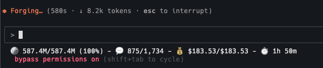

**PAR CC Usage v0.9.0 Released - Enhanced Status Line with Project Names!**

# **What It Does**

Tracks Claude Code usage with real-time token monitoring, pricing analytics, and billing block calculations — now with **project context** in the status line for better multi-project management!



# **What's New in v0.9.0**

## 🏷️ **Project Name Display in Status Line**
- **Project Context**: Status line now shows which project you're working on in square brackets
- **Session-Aware**: Automatically detects project from your Claude Code session
- **Grand Total Support**: Shows project name even when viewing aggregate statistics
- **Improved Clarity**: Instantly know which project's usage you're tracking

## 📊 **Enhanced Status Line Format**
```
[par-cc-usage] - 🪙 38.7M/905.8M (4%) - 💬 75/1,990 - 💰 $12.92/$293.46 - ⏱️ 4h 46m
```
- **NEW**: Project name in square brackets at the beginning
- Token usage with percentage
- Message count tracking
- Real-time cost in USD
- Time remaining in billing block

## 🚀 **Quick Setup**
```bash
# Install/upgrade PAR CC Usage
uv tool install -U par-cc-usage

# Enable status line with one command
pccu install-statusline

# Start monitoring (required for live updates)
pccu monitor
```

# **Previous v0.8.0 Features**
- One-command Claude Code integration setup
- Real-time display in Claude Code's status bar
- Billing block timer showing time remaining
- Session & grand total tracking modes
- Automatic settings.json configuration

# **Core Features**
- 📊 Live token tracking (Opus/6.1x, Sonnet/1x multipliers)
- 🔥 Burn rate + ETA with billing block visualization
- 💰 Real-time cost estimation using LiteLLM pricing
- 🔔 Discord/Slack notifications on block completion
- 🏷️ **NEW: Project name display for context**
- 💻 Claude Code status bar integration
- ⏱️ Block time remaining display
- ⚙️ CLI tool with themes, compact mode, session/project views
- 🛠️ Debug and analytics tools for billing anomalies

# **GitHub & PyPI**

- GitHub: [https://github.com/paulrobello/par_cc_usage](https://github.com/paulrobello/par_cc_usage)
- PyPI: [https://pypi.org/project/par-cc-usage/](https://pypi.org/project/par-cc-usage/)

# **Who's This For?**

If you're managing multiple Claude Code projects and want instant context about which project is consuming tokens — this update is for you. Perfect for developers juggling multiple codebases who need real-time visibility into project-specific usage, costs, and billing status.

**Note**: Remember that `pccu monitor` must be running for the status line to update in real-time.
