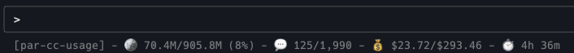

**PAR CC Usage v0.10.0 Released - Advanced Status Line Customization & Model Display**

# **What It Does**

Tracks Claude Code usage with real-time token monitoring, pricing analytics, and billing block calculations — now with **model display**, **customizable separators**, and **session token tracking** for enhanced visibility!



# **What's New in v0.10.0**

## **Model Display & Template Customization**
- **Model Variable**: Display current Claude model name with `{model}` in status line templates
- **Configurable Separator**: Customize the separator string with `statusline_separator` config option
- **Session Token Tracking**: Real-time session token usage with progress bars
- **Advanced Progress Bars**: Rich-style progress bars with colorization and percentage display

## **Enhanced Status Line Format**
```
[par-cc-usage] | Opus | 🪙 38.7M/905.8M (4%) | 💬 75/1,990 | 💰 $12.92/$293.46 | ⏱️ 4h 46m
```
- **NEW**: Model name display (Opus, Sonnet, Haiku)
- **NEW**: Customizable separator (default " - ", can use " | ", " :: ", etc.)
- **NEW**: Session token progress bars with `{session_tokens_progress_bar}`
- Project name, tokens, messages, cost, and time remaining

## **Quick Setup**
```bash
# Install/upgrade PAR CC Usage
uv tool install -U par-cc-usage

# Enable status line with one command
pccu install-statusline

# Start monitoring (required for live updates)
pccu monitor
```

# **Previous v0.9.0 Features**
- Project name display in status line
- Session-aware project detection
- Grand total support with project context
- Improved multi-project management clarity

# **Core Features**
- Live token tracking (Opus/6.1x, Sonnet/1x multipliers)
- Burn rate + ETA with billing block visualization
- Real-time cost estimation using LiteLLM pricing
- Discord/Slack notifications on block completion
- **NEW: Model display and customizable separators**
- Claude Code status bar integration
- Block time remaining display
- CLI tool with themes, compact mode, session/project views
- Debug and analytics tools for billing anomalies

# **GitHub & PyPI**

- GitHub: [https://github.com/paulrobello/par_cc_usage](https://github.com/paulrobello/par_cc_usage)
- PyPI: [https://pypi.org/project/par-cc-usage/](https://pypi.org/project/par-cc-usage/)

# **Who's This For?**

If you're managing multiple Claude Code projects and want enhanced customization of your status line display — this update is for you. Perfect for developers who want to see which Claude model they're using, customize their status line format, and track session-specific token usage with visual progress bars.

**Note**: Remember that `pccu monitor` must be running for the status line to update in real-time.
